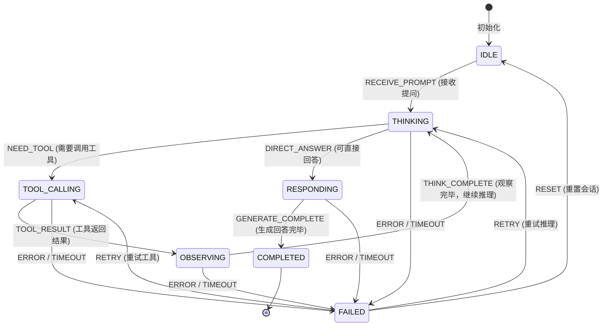
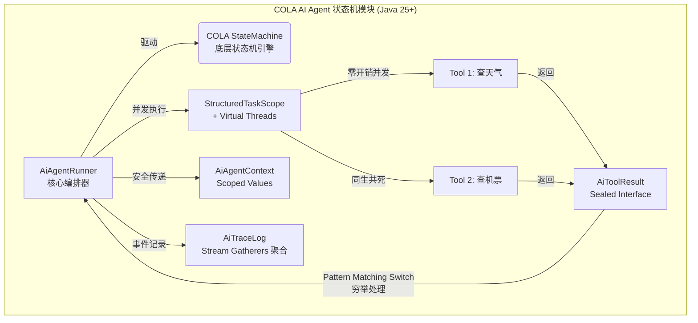
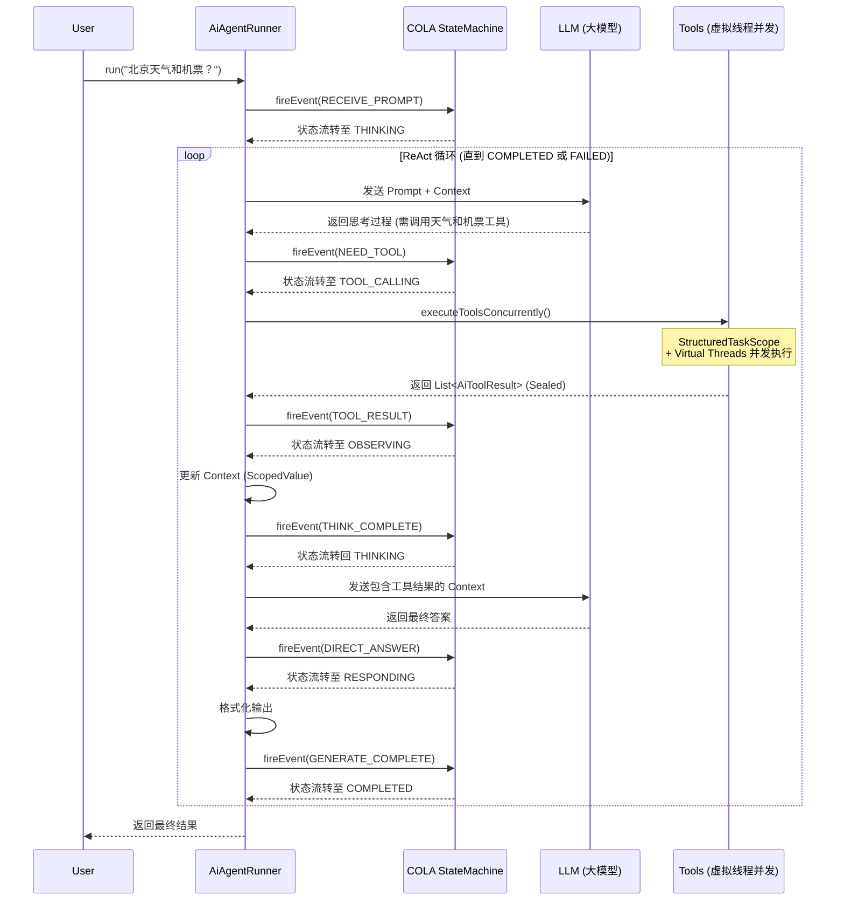

# COLA Ai状态机详解——这个状态机的意义是什么？

## 一.为什么我要创建这个 AI Agent 状态机模块？

最近，公司整体的技术架构方向正在向状态机驱动的业务模式演进,想要这个状态机的这个技术实现业务。在这个过程中，我深度参考了 COLA 架构的设计思想，非常认同其“轻量级、拒绝过度设计”的理念，并在实际的业务落地中受益匪浅。

与此同时，我个人正在使用 Spring AI 开发一个AI 习惯与计划生成平台。在深度使用 Spring AI 的过程中，我产生了一个强烈的 Idea，这也是促使我动手开发这个专属 `AiAgent` 状态机模块的根本原因。

在通常的 AI 聊天应用中，如果我们想让 AI 支持工具调用，Spring AI 的底层做法是通过**反射**去动态调用我们的本地方法。这种机制虽然能跑通，但给系统带来了巨大的“黑盒效应”和不确定性。具体来说，我遇到了以下几个无法忍受的痛点：

1. **并发限流与“裸错”透传**
   当 C 端并发量上来后，大模型 API 极易触发 RPM（每分钟请求数）限流。在现有的机制下，一旦触发限流或网络异常，程序往往会将详细的底层报错直接抛出并展示给前端用户。这在生产环境中是绝对不被允许的，我们需要的是在应用层能拦截异常，并进行优雅降级或友好的话术兜底。

2. **串行调用的性能瓶颈与规则失控**
   目前 AI 在调用工具时往往是串行的。当需要频繁查询本地业务数据时，响应会非常慢。更致命的是，**工具调用的规则和时机完全取决于我选取的那个 AI 模型**。作为应用开发者，我失去了对业务执行流的掌控权。

3. **重试机制的“架构不规范”**
   Spring AI 将限流后的重试机制配置在了 `application.yml` 中。乍一看似乎没什么问题，但从架构设计的角度来看，这种将核心业务重试逻辑与静态配置文件绑定的做法，带来了极大的技术不规范性。它缺乏运行时的动态干预能力，对我个人的代码洁癖而言是不可接受的。

    总体而言，当我的聊天 App 需要同时支持**流式输出、深度思考、工具调用、自动创建习惯和计划**等复杂链路时，整个系统充斥着一种强烈的“不确定感”和“不稳定因素”。

4. **Ai模型能力的缺失**

    对于目前绝大多数LLM模型，它们都无法去主动调用Web去查询具体的文献信息。例如，使用一个具体的业务场景聊天，当我向ai查询今天的日期，某某地的这个天气的时，并让它根据当天的天气去制定锻炼计划的时候，这时候ai并不知道我们的需求，因为它本身不带有web search能力，而如果使用工具类，也就是例如SpringAi 使用ToolParm为Ai注入使用工具查询的这个参数的时候，Ai往往需要在经过多轮选调和使用后造成上下文及其庞大的同时，造成Tool类越来越多，越来越难管理。

于是我开始反思：**我们能否在 Java 应用层，引入一个状态机来严格把控 AI 的执行边界和输出流转？**

既然 AI 的大脑（大模型）是非确定性的，那我们就用确定性的代码架构把它包起来：

- 把 AI 的每一次动作拆解为清晰的状态：`THINKING`（思考中）、`TOOL_CALLING`（工具调用中）、`OBSERVING`（观察结果）、`RESPONDING`（响应中）。
- 在 `TOOL_CALLING` 状态下，我们接管控制权，利用 Java 25 的虚拟线程和结构化并发，**并行**去执行工具调用，解决性能瓶颈。
- 在任何状态下发生限流或异常，状态机统一流转到 `FAILED` 状态，由我们自己的代码决定是 `RETRY`（重试）还是 `RESET`（重置并安抚用户），彻底告别 yml 配置和报错透传。

**这就是我创建这个 `cola-component-statemachine-ai` 模块的根本原因。**

我希望站在 COLA 状态机的肩膀上，结合 Java 25 的最新特性，把 AI Agent 的 ReAct。循环变成一个**白盒化、可观测、强管控**的工程化组件，让 AI 真正稳定地服务于复杂的业务系统中落地。

1. **超时与重试控制**
    - **痛点**：大模型推理可能陷入死循环（如 5 轮还没结果），或者外部工具调用（如 API 请求）超时无响应。
    - **解决**：状态机原生支持在 `THINKING` 或 `TOOL_CALLING` 状态下触发 `TIMEOUT` 事件，并能优雅降级或执行 `RETRY` 策略。
2. **异常分支与恢复**
    - **痛点**：工具调用失败、模型返回 JSON 格式错误、上下文 Token 溢出等，每种异常的恢复策略不同。
    - **解决**：需要一个统一的 `FAILED` 状态兜底，并允许根据异常类型决定是 `RESET` 还是回退到上一个状态重试。
3. **并行执行与汇聚**
    - **痛点**：Agent 经常需要同时调用多个工具（如同时查询天气和股票），传统线程池管理复杂，且容易出现“孤儿线程”（一个失败了，其他的还在跑浪费资源）。
    - **解决**：引入 Java 25 的 **Structured Concurrency ** 和 **Virtual Threads **，实现工具调用的同生共死和结果的自动汇聚。
4. **全链路可观测**
    - **痛点**：AI 的黑盒特性导致调试困难，不知道 Agent 为什么得出这个结论，调用了哪些工具，耗时多久。
    - **解决**：内置 `AiTraceLog`，记录每一次状态流转、工具调用耗时和重试动作，实现白盒化监控。

---

## 二、 技术文档图解

### 1. ReAct 核心状态流转图

展示了 Agent 在思考、调用工具、观察结果和响应之间的完整生命周期，以及异常兜底机制。

### 2. 架构与 Java 25 特性映射图

展示了模块内部组件如何利用 Java 25 的最新特性来解决 AI 场景的并发和类型安全问题。

### 3. ReAct 交互时序图

展示了一次典型的“用户提问 -> Agent 思考 -> 并发调用工具 -> 观察结果 -> 最终回答”的完整时序。

---

## 三、 详细技术逻辑说明

具体技术逻辑如下：

### 1. 状态流转逻辑

`AiAgentRunner` 是整个模块的心脏。它内部封装了 COLA 的 `StateMachine`，通过一个 `while` 循环不断推进状态，直到达到 `COMPLETED` 或 `FAILED`。

- **Pattern Matching Switch**：在主循环中，使用 Java 21+ 的 `switch` 表达式处理当前状态，编译器会强制检查是否覆盖了所有枚举值，避免遗漏状态处理。

### 2. 并发工具调用

在 `TOOL_CALLING` 状态下，Agent 可能需要同时调用多个外部 API。

- 实现逻辑：使用 `StructuredTaskScope`。将一组工具调用视为一个结构化的工作单元。结合虚拟线程（Virtual Threads），即使发起 1000 个并发的 HTTP 请求，也不会阻塞系统 OS 线程。如果设置了 `withTimeout`，一旦超时，所有未完成的虚拟线程会被自动中断（Cancel），防止资源泄漏。

### 3. 结果处理与类型安全

工具调用的结果是极其复杂的（成功、失败、超时、限流等）。

- **实现 逻辑**：定义 `AiToolResult` 为 `sealed interface`，并限制其子类只能是 `Success`, `Failure`, `Timeout` 这几个 `record`。
- **优势**：在 `OBSERVING` 状态处理结果时，使用 `switch (result)`，编译器会进行**穷举检查**。如果未来新增了 `RateLimit` 结果类型，编译器会直接报错，强制开发者处理新分支，杜绝了 `if-else` 漏写导致的线上 Bug。

### 4. 上下文安全传递

AI Agent 在多轮对话中需要维护庞大的上下文（Prompt、历史记录、工具结果）。

- **实现 逻辑**：使用 `ScopedValue<AiAgentContext>`。它是不可变的、单向传递的，专为虚拟线程设计。在 `AiAgentRunner.run` 方法入口绑定后，整个 ReAct 链路（包括派生出的并发工具子线程）都能安全、零开销地读取到当前会话的 Context。

### 5. 全链路追踪与聚合 (Stream Gatherers)

- **逻辑**：`AiTraceLog` 记录了所有的状态变更和工具调用事件。
- **实现逻辑**：利用 JDK 24/25 的 `Stream Gatherers`，可以非常方便地对这些事件流进行自定义的窗口聚合（Windowing）或状态机折叠（Folding），例如快速统计出“连续失败超过 3 次的工具”或“平均耗时最长的推理阶段”，为监控大盘提供数据。
